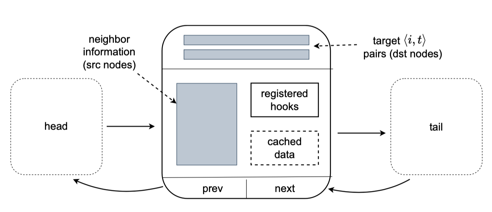

.. _api-block:

tglite.TBlock
=============

TBlock captures 1-hop relationships between node/time pairs and their neighbors for doing computations. :ref:`Figure
<tblock figure>` shows the internal structure of a TBlock and the doubly-linked list design with next and prev pointing
to sampled neighbors' TBlock.

.. _tblock figure:

   Diagram of the doubly-linked list design and internal structure of a TBlock (destination node-time is denoted as
   <i,t>).

.. currentmodule:: tglite
.. autoclass:: TBlock

   .. automethod:: __init__

.. currentmodule:: tglite.TBlock

Query TBlock attributes
----------------------
.. autosummary::
   :toctree: ../../generated/

   g
   layer
   dstnodes
   dsttimes
   num_dst

Query neighbor attributes
-------------------------
.. autosummary::
   :toctree: ../../generated/

   dstindex
   srcnodes
   num_src
   eid
   ets
   num_edges
   has_nbrs

Query data
----------
.. autosummary::
   :toctree: ../../generated/

   dstdata
   srcdata
   edata

Query Cache
-----------
.. autosummary::
   :toctree: ../../generated/

   allnodes
   uniq_src
   efeat
   nfeat
   srcfeat
   dstfeat
   mem_data
   mail
   time_deltas

Neighbor ops
------------
.. autosummary::
   :toctree: ../../generated/

   set_nbrs
   clear_nbrs

Linked list ops
---------------
.. autosummary::
   :toctree: ../../generated/

   prev
   next
   next_block

Execution ops
-------------
.. autosummary::
   :toctree: ../../generated/

   apply
   register_hook
   run_hooks
   clear_hooks

